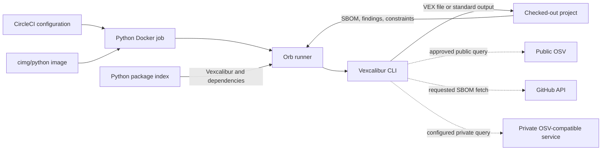

# Runtime and trust boundaries

The orb is a delivery wrapper, not another VEX engine. It chooses a Python runtime and installs Vexcalibur before handing control to the CLI. That narrow role keeps the orb flexible. It also means a pipeline crosses several trust boundaries before it produces a document.

## What runs where

This diagram shows the default path and the optional service calls. Dotted arrows depend on the Vexcalibur arguments supplied by the workflow.

In plain terms, CircleCI first supplies the Docker image. The runner then reads local inputs and installs the selected package. Vexcalibur writes locally unless its arguments ask it to call OSV or GitHub.

## Isolation has a narrow meaning

Each command invocation creates a new virtual environment under a temporary directory. The runner invokes Python and pip in isolated mode. It disables pip's cache and configuration file, then removes inherited `PYTHON*`, `PIP_*`, and `PIPX_*` environment variables. The runner deletes the temporary directory when the command exits.

That protects the install from many accidental Python and pip settings. It does not isolate the process from the network, the checked-out repository, other environment variables, or the permissions of the CircleCI job.

The runner also avoids a shell round trip for Vexcalibur arguments. Each nonempty `args` line becomes one array element, and the script invokes the executable with that array. Shell operators inside an argument aren't evaluated by the runner.

## Installation is part of the job

The default `package_spec` pins Vexcalibur itself to the exact release listed in the [orb reference](../reference/orb.md#compatibility-and-defaults). Pip still resolves and downloads its dependencies each time the command runs. A `constraints_file` can pin those transitive versions, but the runner doesn't enable pip's hash-checking mode.

The default executor also uses the moving minor tag `cimg/python:3.14`. Pin `python_version` to a patch tag and use a reviewed constraints file when repeatability matters. Those choices reduce drift; they don't turn the job into a hermetic build because container tags and package indexes remain external inputs.

Setting `allow_development_package_spec` broadens the code that pip may install and execute. Use it only with a source and revision that the workflow owner trusts. The runner's input checks catch leading pip options and a common credential-bearing URL form, not every unsafe requirement syntax.

Installing at run time keeps Vexcalibur and Python selection visible in pipeline configuration. It also costs network access and setup time. [Issue #4](https://github.com/vexcalibur-dev/vexcalibur-orb/issues/4) tracks the separate question of whether a prebuilt, signed Vexcalibur image would be a better default.

## The workflow owns outbound data decisions

Pip can contact its package index during every invocation. After installation, Vexcalibur decides which other services to call from its CLI options.

Public OSV is a deliberate boundary. Vexcalibur refuses to send package URLs, versions, or SBOM-derived inventory to `https://api.osv.dev` without `--allow-public-osv`, and the orb never adds that flag. The workflow owner has to decide whether the submitted inventory is public enough to share.

GitHub SBOM input and private OSV-compatible services have their own URLs and credentials. The orb doesn't proxy those requests or reduce the access granted to Vexcalibur. Review the [Vexcalibur CLI reference](https://vexcalibur-dev.github.io/vexcalibur/reference/cli.html) before enabling either path.

## Credentials stay in the job environment

Store service credentials in a restricted CircleCI context or project environment variable. Vexcalibur can read supported token variables, including `GH_TOKEN` and `GITHUB_TOKEN` for GitHub.com. The runner removes Python and pip variables, but it doesn't remove those GitHub variables before starting Vexcalibur.

Pass an environment variable name through `args` when a Vexcalibur option asks for one. Don't put the secret value itself in `args`, a package spec, or a checked-in constraints file. Virtual-environment cleanup can't remove a value already written to configuration, logs, caches outside the temporary directory, or stored artifacts.

CircleCI controls the job's effective permissions, context access, artifact visibility, and retention. The orb inherits those decisions. Treat a generated VEX document as security data when it contains private component inventory or vulnerability assessments, and restrict its artifact access accordingly.

## Orb publication uses a separate credential boundary

The repository's own publication workflow does not give the registry token to the jobs that pack or test the orb. Those jobs record the packed `orb.yml` SHA-256 and pass the file with its checksum through a CircleCI workspace. Only the later publish job receives the restricted `orb-publishing` context. It runs in a CircleCI CLI image pinned by tag and registry digest and verifies the checksum before invoking the registry command.

The checksum detects corruption between the pack and publish steps, but it does not independently authenticate CircleCI's workspace because the file and checksum use the same storage path. Context restrictions, release approval, CircleCI workspace controls, and the immutable executor pin are all part of this boundary. The [publishing guide](../how-to/publish-orb.md) describes the release procedure and recovery checks.

## Output survives only when the workflow preserves it

The runner deletes its temporary installation, but it doesn't delete files Vexcalibur writes to the CircleCI working directory. A custom job can store those files as artifacts or persist them to a workspace for a later job.

The reusable `run` job has no built-in artifact step. If it writes only to `/tmp`, the result disappears with the container. The bundled [CycloneDX](../../src/examples/generate_vex_from_sbom.yml), [OpenVEX](../../src/examples/generate_openvex.yml), and [CSAF](../../src/examples/generate_csaf.yml) examples use custom jobs to preserve their generated documents.

When `--output` names a CSAF file, its basename comes from the document tracking ID. The CSAF example writes that exact name into the working directory before `store_artifacts` preserves it. Artifact storage does not sign or publish the document; CircleCI only retains the local file under the project's artifact policy.
