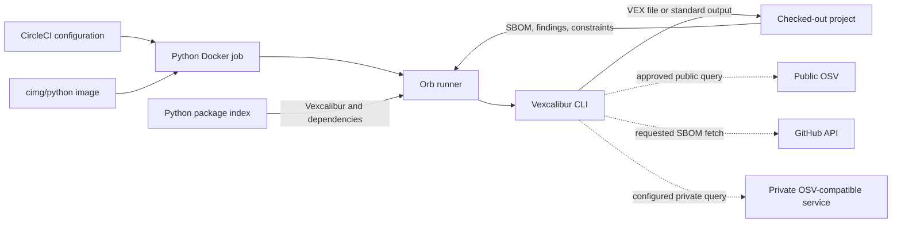

# Runtime and trust boundaries

The orb is a delivery wrapper, not another VEX engine. It chooses a Python runtime and installs Vexcalibur before handing control to the CLI. That narrow role keeps the orb flexible. It also means a pipeline crosses several trust boundaries before it produces a document.

## What runs where

This diagram shows the default path and the optional service calls. Dotted arrows depend on the Vexcalibur arguments supplied by the workflow.

```mermaid
flowchart LR
    config[CircleCI configuration] --> job[Python Docker job]
    image[cimg/python image] --> job
    workspace[Checked-out project] -->|SBOM, findings, constraints| runner[Orb runner]
    job --> runner
    index[Python package index] -->|Vexcalibur and dependencies| runner
    runner --> cli[Vexcalibur CLI]
    cli -->|VEX file or standard output| workspace
    cli -. approved public query .-> osv[Public OSV]
    cli -. requested SBOM fetch .-> github[GitHub API]
    cli -. configured private query .-> mirror[Private OSV-compatible service]
```

In plain terms, CircleCI first supplies the Docker image. The runner then reads local inputs and installs the selected package. Vexcalibur writes locally unless its arguments ask it to call OSV or GitHub.

## Isolation has a narrow meaning

Each command invocation creates a new virtual environment under a temporary directory. The runner invokes Python and pip in isolated mode. It disables pip's cache and configuration file, then removes inherited `PYTHON*`, `PIP_*`, and `PIPX_*` environment variables. The runner deletes the temporary directory when the command exits.

That protects the install from many accidental Python and pip settings. It does not isolate the process from the network, the checked-out repository, other environment variables, or the permissions of the CircleCI job.

The runner also avoids a shell round trip for Vexcalibur arguments. Each nonempty `args` line becomes one array element, and the script invokes the executable with that array. Shell operators inside an argument aren't evaluated by the runner.

## Installation is part of the job

The default `package_spec` pins Vexcalibur itself to the exact release listed in the [orb reference](../reference/orb.md#compatibility-and-defaults). Pip still resolves and downloads its dependencies each time the command runs. A `constraints_file` can pin those transitive versions, but the runner doesn't enable pip's hash-checking mode.

The default executor pins `cimg/python:3.14.5` by digest. Keep that default unless you have a reason to use another image. A reviewed constraints file can further limit pip dependency changes, but the job is not hermetic because package indexes remain external inputs.

Setting `allow_development_package_spec` broadens the code that pip may install and execute. Use it only with a source and revision that the workflow owner trusts. The runner's input checks catch leading pip options and a common credential-bearing URL form, not every unsafe requirement syntax.

Installing at run time keeps Vexcalibur and Python selection visible in pipeline configuration. It also costs network access and setup time. [Issue #4](https://github.com/vexcalibur-dev/vexcalibur-orb/issues/4) tracks the separate question of whether a prebuilt, signed Vexcalibur image would be a better default.

## The workflow owns outbound data decisions

Pip can contact its package index during every invocation. After installation, Vexcalibur decides which other services to call from its CLI options.

Public OSV is a deliberate boundary. Vexcalibur refuses to send package URLs, versions, or SBOM-derived inventory to `https://api.osv.dev` without `--allow-public-osv`, and the orb never adds that flag. The workflow owner has to decide whether the submitted inventory is public enough to share.

GitHub SBOM input and private OSV-compatible services have their own URLs and credentials. The orb doesn't proxy those requests or reduce the access granted to Vexcalibur. Review the [Vexcalibur CLI reference](https://vexcalibur-dev.github.io/vexcalibur/reference/cli.html) before enabling either path.

## Credentials stay in the job environment

Store service credentials in a restricted CircleCI context or project environment variable. Vexcalibur can read supported token variables, including `GH_TOKEN` and `GITHUB_TOKEN` for GitHub.com. The runner removes Python and pip variables, but it doesn't remove those GitHub variables before starting Vexcalibur.

Pass an environment variable name through `args` when a Vexcalibur option asks for one. Don't put the secret value itself in `args`, a package spec, or a checked-in constraints file. Virtual-environment cleanup can't remove a value already written to configuration, logs, caches outside the temporary directory, or stored artifacts.

CircleCI controls the job's effective permissions, context access, artifact visibility, and retention. The orb inherits those decisions. Treat a generated VEX document as security data when it contains private component inventory or vulnerability assessments, and restrict its artifact access accordingly.

## Orb publication uses a separate credential boundary

CircleCI tests and packs without a registry credential. GitHub Actions owns the one `CIRCLE_TOKEN` secret in a branch-restricted environment, then waits for CircleCI's exact pipeline, workflow, and job results before it packs again and publishes. The two systems therefore have different jobs: CircleCI supplies independent test evidence, while GitHub controls release metadata and registry access.

The previous `orb-publishing` CircleCI context and its token are removed before
this model becomes active. That matters even though the new verifier rejects
rerun evidence: an older immutable CircleCI configuration could otherwise use
the context and publish before GitHub evaluates the evidence.

The CircleCI setup workflow uses checked-in jobs on the digest-pinned CircleCI CLI image. Those jobs pack and validate the Orb, then submit the checked-in continuation configuration. They don't install tools or execute a reusable setup Orb whose dependencies could change after review. GitHub CI runs the repository-pinned ShellCheck release before publication can begin.

For development versions, GitHub accepts only a successful `CI` workflow for a push from this repository's current `main` commit. It publishes a commit-specific development reference first, checks `main` again, and only then moves `dev:alpha`. Serialization prevents two successful runs from racing the mutable alias.

For production versions, GitHub checks out current release tooling separately from the immutable tag source. The tooling verifies the exact CircleCI tag pipeline and packs the tag's `src` directory. The publisher then reads the registry source back and compares its bytes with the candidate. A retry can confirm an existing matching version, but it cannot replace a different one.

This division avoids a CircleCI authorization problem: an App-created GitHub tag does not have to map to a human CircleCI organization member before publication can start. It also keeps the broad personal CircleCI token out of CircleCI jobs and workspaces. The [publishing guide](../how-to/publish-orb.md) describes setup, release, recovery, and rotation.

## Output survives only when the workflow preserves it

The runner deletes its temporary installation, but it doesn't delete files Vexcalibur writes to the CircleCI working directory. A custom job can store those files as artifacts or persist them to a workspace for a later job.

The reusable `run` job has no built-in artifact step. If it writes only to `/tmp`, the result disappears with the container. The bundled [CycloneDX](../../src/examples/generate_vex_from_sbom.yml), [OpenVEX](../../src/examples/generate_openvex.yml), and [CSAF](../../src/examples/generate_csaf.yml) examples use custom jobs to preserve their generated documents.

When `--output` names a CSAF file, its basename comes from the document tracking ID. The CSAF example writes that exact name into the working directory before `store_artifacts` preserves it. Artifact storage does not sign or publish the document; CircleCI only retains the local file under the project's artifact policy.
