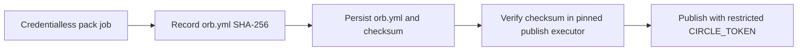
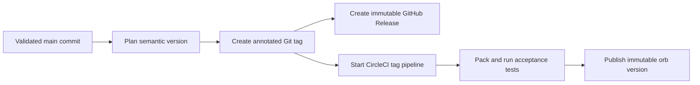

# Publish the orb

This guide is for Vexcalibur maintainers who can administer the CircleCI organization, its contexts, and GitHub release tags. The `vexcalibur-dev/vexcalibur` registry entry exists and development versions publish from `main` after the hosted checks pass.

The GitHub release setup is complete. GitHub enforces immutable releases, restricts release-tag creation to the Vexcalibur automation App, and prevents every actor from updating or deleting a release tag. The CircleCI setup is ready only when the verifier in step 10 passes. The [production release policy](../reference/release-policy.md) records the exact GitHub controls and signed owner evidence.

A production orb version is immutable. Complete the development publication and verification before you dispatch the first release. The automation creates the tag; maintainers don't create release-looking tags by hand.

The `orb-publishing` context must keep the `vexcalibur-orb` project as its sole
authorization grant. Do not add `All members` or another security group.
CircleCI treats project and group assignments as alternatives, not cumulative
requirements. Every CircleCI organization administrator must also be trusted
because administrators retain access to restricted contexts.

## Gather the required access

You need:

- Owner access to the Vexcalibur CircleCI organization
- Maintainer access to `vexcalibur-dev/vexcalibur-orb` on GitHub
- Repository admin access when you recover a GitHub webhook delivery
- A CircleCI personal API token owned by an identity that can publish the Vexcalibur namespace
- Permission to create a restricted CircleCI context
- The [CircleCI CLI](https://circleci.com/docs/guides/toolkit/local-cli/) for local checks and registry verification
- A separate [CircleCI personal API token](https://circleci.com/docs/guides/toolkit/managing-api-tokens/) for monitoring or rerunning a failed hosted workflow

The token used by the publishing jobs grants broad organization access. CircleCI personal tokens don't have selectable scopes. Store this token only in the CircleCI context described below, and use an identity that can publish the Vexcalibur namespace. Don't reuse it for local CLI work or add it to another secret store for this workflow. Never export it in a shared shell or paste it into configuration. Use a separate personal token as `CIRCLECI_OPERATOR_TOKEN` when you run the monitoring and recovery commands in this guide, then unset it when you finish. Give the operator token a short expiration and revoke it when it is no longer needed.

Run `circleci setup` to authenticate the local CLI through its prompt with your maintainer credentials. Confirm the CircleCI host, then verify the organization UUID separately before creating registry resources.

## Create the registry resources once

Skip a step when the named resource already exists and is owned by the expected Vexcalibur organization. The namespace and public orb are global registry names; don't create substitutes from a personal organization.

1. Find the CircleCI organization UUID and assign it locally:

   ```bash
   CIRCLECI_ORG_ID=00000000-0000-0000-0000-000000000000
   ```

   Replace the reserved example UUID with the Vexcalibur CircleCI organization UUID.

2. Create the public namespace:

   ```bash
   circleci namespace create vexcalibur-dev --org-id "$CIRCLECI_ORG_ID" --no-prompt
   ```

3. Create the public orb:

   ```bash
   circleci orb create vexcalibur-dev/vexcalibur --no-prompt
   ```

   The command creates a world-readable registry entry. It doesn't publish a version.

4. Connect `vexcalibur-dev/vexcalibur-orb` through CircleCI's GitHub OAuth integration. The resulting `github` project type and Git URL must match the expression in step 8.

5. In **Project Settings** > **Advanced**, confirm **Enable dynamic config using setup workflows** is on. CircleCI enables it by default for newer projects, but the setting still needs verification. The checked-in `.circleci/config.yml` has `setup: true` and uses `orb-tools/continue` to load `.circleci/test-deploy.yml`. See CircleCI's [dynamic configuration setup](https://circleci.com/docs/guides/orchestrate/dynamic-config/#enable-dynamic-config).

6. Create an empty CircleCI context named `orb-publishing`. Don't add the
   production token yet.

   ```bash
   circleci context create --org-id "$CIRCLECI_ORG_ID" orb-publishing
   ```

   Skip this command when the context already exists.

7. Add a project restriction that limits `orb-publishing` to `vexcalibur-dev/vexcalibur-orb`. Don't leave a publishing context available to every project in the organization.

8. Add this expression restriction to `orb-publishing`:

   ```text
   pipeline.project.type == "github" and pipeline.project.git_url == "https://github.com/vexcalibur-dev/vexcalibur-orb" and (pipeline.git.branch == "main" or pipeline.git.tag matches /^v[0-9]+\.[0-9]+\.[0-9]+$/) and not job.ssh.enabled and not (pipeline.config_source starts-with "api")
   ```

   The expression repeats the exact GitHub repository identity, then permits
   the publishing context only on `main` or an exact production tag. It rejects
   SSH reruns and unversioned API configuration. CircleCI fails closed when a
   value is missing or the expression cannot be evaluated.

9. Remove every security-group restriction, including `All members`. Keep the
   `vexcalibur-orb` project restriction as the only authorization grant.

   Project and group restrictions are OR grants in CircleCI. Adding a group
   would let that group use the context from another project when the expression
   matches. The expression in step 8 supplies the second, independent repository
   identity check. Organization administrators retain unrestricted context
   access, so every administrator must be trusted to publish.

10. Verify the live context restrictions in CircleCI. The context must show the
    `vexcalibur-orb` project and the exact expression from step 8. It must not
    show a security-group restriction.

    CircleCI documents [project, group, and expression restrictions](https://circleci.com/docs/guides/security/contexts/#restrict-a-context).
    Complete this verification before storing or using the production token.

    After you export a separate personal API token as `CIRCLECI_OPERATOR_TOKEN`, run the read-only policy check from the repository root:

    ```bash
    python -I scripts/verify_circleci_release_context.py
    unset CIRCLECI_OPERATOR_TOKEN
    ```

    The command should report that it verified the project and expression restrictions. It fails if the project changes, the context has any group grant, or the expression no longer binds the exact repository to `main` and release tags. It also checks the SSH and API-config rejection terms. The first production tag pipeline is the positive hosted test for exact-tag access; don't test the negative paths by trying to expose the publishing context from an SSH or API-supplied job.

11. Add GitHub tag rulesets for `v*`. Allow only the Vexcalibur automation App
    to create release tags, and don't allow any actor to update or delete them.
    Verify the live bypass actors and rules before continuing. The CircleCI
    release workflow narrows production tags further to
    `vMAJOR.MINOR.PATCH`.

    Configure the App permissions, rules, bypass actors, and signed attestation exactly as described in the [production release policy](../reference/release-policy.md). A repository Actions variable is not valid owner evidence because a repository writer can replace it without changing reviewed source.

12. Store the personal API token under the exact variable name `CIRCLE_TOKEN`:

    ```bash
    circleci context store-secret --org-id "$CIRCLECI_ORG_ID" orb-publishing CIRCLE_TOKEN
    ```

    `store-secret` prompts for the value so it doesn't become a command-line
    argument.

Rotate the token when a trusted CircleCI administrator loses access or whenever the credential may have been exposed. Update the context after rotation and confirm the former token no longer works.

## Validate the source locally

Follow [the contributor setup](../../CONTRIBUTING.md#prepare-a-development-environment), activate `.venv`, and run these commands from the repository root:

```bash
python -m unittest discover -s tests
scripts/validate-circleci.sh
```

Both commands should exit with status `0`. The validation script packs the source, injects it into `.circleci/test-deploy.yml`, processes both CircleCI configurations, and checks the sensitive jobs' executor and step order. It validates every generated configuration. Generated files stay in a temporary directory.

The publication handoff separates artifact creation from credential use:



The pack job runs without the `orb-publishing` context. It stores the checksum as a CircleCI artifact and persists `orb.yml` with its one-entry checksum manifest. The publish job uses the same CircleCI CLI image pinned by tag and registry digest, attaches those two files, and verifies the digest before the orb-tools publication step. A checksum mismatch stops the job before publication. The workflow disables orb-tools' optional pull-request comment, so the publishing context does not need a GitHub token.

The checksum detects an artifact that changed between the two stages. Because
the orb and checksum travel through the same CircleCI workspace, it does not
independently authenticate CircleCI's storage. The project and expression
restrictions remain part of the release trust boundary. So do the immutable
executor image, CircleCI workspace controls, and the set of trusted CircleCI
administrators.

## Publish and test a development version

Push the release candidate to `main`. CircleCI runs the setup workflow, then continues into `test-deploy` with the packed local orb inserted under the `vexcalibur` name.

`publish-dev` runs automatically after all four prerequisites succeed:

- `pack-dev`
- `command-help-test`
- `format-output-test`
- `job-help-test`

Open the `pack-dev` artifacts and confirm `packed-orb/orb.yml.sha256` contains one SHA-256 entry for `orb.yml`. The `publish-dev` job verifies that entry before it publishes.

The `publish-dev` job uses the restricted context to publish two development aliases: `dev:<commit-sha>` and `dev:alpha`. Development versions expire after 90 days, and both aliases are mutable. The commit-shaped name identifies the intended publication; it does not make that publication immutable.

From a checkout of the published commit, run:

```bash
DEV_VERSION="dev:$(git rev-parse HEAD)"
circleci orb info "vexcalibur-dev/vexcalibur@${DEV_VERSION}"

(
  set -euo pipefail
  PACKED_SOURCE="$(mktemp)"
  REGISTRY_SOURCE="$(mktemp)"
  trap 'rm "$PACKED_SOURCE" "$REGISTRY_SOURCE"' EXIT

  circleci orb pack --skip-update-check src >"$PACKED_SOURCE"
  circleci orb source --skip-update-check \
    "vexcalibur-dev/vexcalibur@${DEV_VERSION}" >"$REGISTRY_SOURCE"
  python - "$PACKED_SOURCE" "$REGISTRY_SOURCE" <<'PY'
from pathlib import Path
import sys

packed = Path(sys.argv[1]).read_bytes()
registry = Path(sys.argv[2]).read_bytes()
if registry not in (packed, packed + b"\n"):
    raise SystemExit("registry source differs from the locally packed orb")
PY
)
```

The metadata command should resolve the named development version. The source
comparison should produce no output and exit with status `0`; it ignores only
one trailing newline added by the registry. Confirm the production
`publish-release` job did not run on the branch pipeline.

The continuation tests exercise the packed command and job with `--help`. They also generate and validate CycloneDX, OpenVEX, and CSAF JSON from checked-in local fixtures. The format test uses `--offline` and never queries public OSV.

The CSAF check verifies:

- Publisher and tracking metadata
- The first document revision
- The Vexcalibur generator version
- A versioned product package URL
- The `under_investigation` mapping
- The absence of a root `$schema` property

These checks run only in hosted CircleCI. Local configuration validation proves that the workflow parses, not that its jobs have executed.

## Release a production version

The GitHub `Release` workflow controls production release metadata. It waits for CI on the exact source commit, recalculates the release plan, checks the live immutable-release policy and tag rules, and then creates an annotated tag and GitHub Release with the Vexcalibur automation App. The App token exists only during the publication job.

CircleCI remains the only production registry publisher. The App-created tag starts a CircleCI tag pipeline with this sequence:



Don't create, move, replace, or delete a release-looking tag. A failed release is recovered from the existing tag; a released defect gets a new version.

The workflow checks live `main` again immediately before publication. That observation establishes the release order: a `main` push accepted afterward is a later candidate and starts its own serialized release run. The tag and `release-coordination` branch update are one atomic Git transaction.

The internal `release-coordination` branch serializes release-tag creation. It points to a synthetic commit that records the latest tag object and its source commit. Different tags produce different coordination commits, so Git checks the branch lease even when two attempts target the same source. It is mutable coordination state, not a release version. CircleCI ignores pushes to that branch. Don't edit it. Existing-tag recovery reconstructs a missing branch from the verified immutable tag graph, but stops on a conflicting value.

### Dispatch the first release

Use this procedure once, when no production tag exists. Run it with Bash 4 or newer from a clean checkout of `vexcalibur-dev/vexcalibur-orb`. The commands require a current GitHub CLI that supports the `gh run list --created` filter, authenticated as a maintainer.

1. Update the local `main` branch and confirm that no release tag exists:

   ```bash
   git fetch --prune --tags origin
   git switch main
   git pull --ff-only origin main
   test -z "$(git tag --list 'v*' | awk 'index($0, "/") == 0')"
   RELEASE_SHA="$(git rev-parse HEAD)"
   ```

   The `test` command produces no output when this is the first release. It ignores names such as `v/unprotected` because the release rules don't cover tags that contain `/`. Stop if the command returns a nonzero status; use the recovery procedure for an existing production tag.

2. Dispatch the planned first version:

   ```bash
   RELEASE_TAG=v0.1.0
   TOOLING_SHA="${RELEASE_SHA}"
   DISPATCHED_AT="$(date -u +%Y-%m-%dT%H:%M:%SZ)"
   RUN_URL="$(gh workflow run release.yml \
     --repo vexcalibur-dev/vexcalibur-orb \
     --ref main \
     --field expected_source_sha="${RELEASE_SHA}" \
     --field tag="${RELEASE_TAG}")"
   ```

   An explicit new tag is accepted only when the repository has no production tags. The expected source input makes the workflow stop if `main` moves between the local fetch and the dispatch. Later versions come from Conventional Commits.

3. Resolve the exact manual run and wait for it:

   ```bash
   RUN_ID=""
   if [[ "${RUN_URL}" =~ /actions/runs/([0-9]+)(\?.*)?$ ]]; then
     RUN_ID="${BASH_REMATCH[1]}"
   else
     for _attempt in {1..12}; do
       mapfile -t matching_runs < <(
         gh run list \
           --repo vexcalibur-dev/vexcalibur-orb \
           --workflow release.yml \
           --event workflow_dispatch \
           --commit "${TOOLING_SHA}" \
           --created ">=${DISPATCHED_AT}" \
           --json databaseId \
           --limit 20 \
           --jq '.[].databaseId'
       )
       if (( ${#matching_runs[@]} == 1 )); then
         RUN_ID="${matching_runs[0]}"
         break
       fi
       if (( ${#matching_runs[@]} > 1 )); then
         echo "More than one matching manual release run was found." >&2
         exit 1
       fi
       sleep 5
     done
   fi
   [[ "${RUN_ID}" =~ ^[0-9]+$ ]]
   gh run watch \
     --repo vexcalibur-dev/vexcalibur-orb \
     --exit-status \
     "${RUN_ID}"
   ```

   The event, commit, dispatch time, and returned URL prevent the automatic push run for the same commit from being mistaken for this manual run. Success means every `Release` job completed. It also means the tag and immutable GitHub Release match the planned source, but the CircleCI registry publication can still be running.

### Release later versions

After the first release, each push to `main` recalculates the next version from commits after the latest production tag. The highest matching change controls the bump:

| Bump | Conventional Commit input |
| --- | --- |
| Major | A subject with `!`, such as `feat!:`, or a `BREAKING CHANGE:` footer |
| Minor | A `feat:` subject, including a scoped subject such as `feat(orb):` |
| Patch | `fix:`, `perf:`, `refactor:`, `deps:`, `revert:`, `build(deps):`, `chore(deps):`, or a Git-generated revert subject |
| None | Other commit types, or a current commit containing `[skip release]` or `[release skip]` |

The workflow doesn't write a version to the repository. It derives `vMAJOR.MINOR.PATCH` from immutable tags, so the release version remains metadata.

You can dispatch the workflow without a `tag` input to retry planning on the current `main` commit. Capture that commit first so the dispatch can't race with another merge:

```bash
TOOLING_SHA="$(
  gh api repos/vexcalibur-dev/vexcalibur-orb/git/ref/heads/main \
    --jq '.object.sha'
)"
gh workflow run release.yml \
  --repo vexcalibur-dev/vexcalibur-orb \
  --ref main \
  --field expected_source_sha="${TOOLING_SHA}"
```

### Verify GitHub and CircleCI publication

Keep `RELEASE_TAG` and `RELEASE_SHA` from the dispatch procedure. For an automatic release, resolve both values from the latest immutable GitHub Release:

```bash
RELEASE_TAG="$(
  gh api repos/vexcalibur-dev/vexcalibur-orb/releases/latest --jq '.tag_name'
)"
TAG_OBJECT_SHA="$(
  gh api "repos/vexcalibur-dev/vexcalibur-orb/git/ref/tags/${RELEASE_TAG}" \
    --jq '.object.sha'
)"
RELEASE_SHA="$(
  gh api "repos/vexcalibur-dev/vexcalibur-orb/git/tags/${TAG_OBJECT_SHA}" \
    --jq '.object.sha'
)"
```

The remaining commands require `gh`, the CircleCI CLI, and a personal CircleCI API token exported as `CIRCLECI_OPERATOR_TOKEN`. Do not use the `CIRCLE_TOKEN` value from the publishing context.

1. Check the protected GitHub Release projection:

   ```bash
   (
     set -euo pipefail
     RELEASE_JSON="$(mktemp)"
     trap 'rm -f "${RELEASE_JSON}"' EXIT

     APP_SLUG=vexcalibur-dev-automation
     BOT_NAME="${APP_SLUG}[bot]"
     BOT_USER_ID="$(gh api "/users/${APP_SLUG}%5Bbot%5D" --jq '.id')"
     BOT_EMAIL="${BOT_USER_ID}+${BOT_NAME}@users.noreply.github.com"
     EXPECTED_MAIN_SHA="$(
       gh api repos/vexcalibur-dev/vexcalibur-orb/git/ref/heads/main \
         --jq '.object.sha'
     )"
     git fetch --prune --tags origin main
     test "$(git rev-parse refs/remotes/origin/main)" = "${EXPECTED_MAIN_SHA}"
     gh api \
       "repos/vexcalibur-dev/vexcalibur-orb/releases/tags/${RELEASE_TAG}" \
       >"${RELEASE_JSON}"
     python -I scripts/release.py verify-published-release \
       --release-json "${RELEASE_JSON}" \
       --tag "${RELEASE_TAG}" \
       --commit "${RELEASE_SHA}" \
       --main-commit "${EXPECTED_MAIN_SHA}" \
       --expected-author "${BOT_NAME}" \
       --expected-tagger-name "${BOT_NAME}" \
       --expected-tagger-email "${BOT_EMAIL}"
   )
   ```

   The verifier checks the complete immutable tag graph, including release order and predecessor metadata. It also requires the automation App's tagger identity and exact canonical tag annotation. It regenerates the protected notes, then checks the tag, commit, title, body, release author, immutable state, draft and prerelease flags, and empty asset list. The command names the verified tag and exits with status `0` when every field matches.

2. Find the CircleCI tag pipeline and inspect its workflows:

   ```bash
   test -n "${CIRCLECI_OPERATOR_TOKEN:-}"
   PIPELINE_ID="$(
     python -I scripts/circleci_release_status.py \
       pipeline-id "${RELEASE_TAG}" "${RELEASE_SHA}"
   )"
   python -I scripts/circleci_release_status.py \
     verify-pipeline "${PIPELINE_ID}"
   ```

   The helper follows every API page and selects the highest-numbered pipeline for the exact tag, repository, and release commit. It evaluates only the newest attempt for each workflow name. It requires the `lint-pack` and `test-deploy` workflows plus every acceptance, packing, source, and publication job in `test-deploy`. The final command prints tab-separated workflow and job names, `success`, and IDs before it exits with status `0`. Rerun it while a workflow is still running. A nonzero status after CircleCI finishes means the production orb was not verified as published.

3. Confirm the public registry version and compare its source with the release commit:

   ```bash
   ORB_VERSION="${RELEASE_TAG#v}"
   circleci orb info "vexcalibur-dev/vexcalibur@${ORB_VERSION}"

   (
     set -euo pipefail
     PACKED_SOURCE="$(mktemp)"
     REGISTRY_SOURCE="$(mktemp)"
     WORKTREE="${PACKED_SOURCE}.worktree"
     cleanup() {
       git worktree remove --force "${WORKTREE}" >/dev/null 2>&1 || true
       rm -f "${PACKED_SOURCE}" "${REGISTRY_SOURCE}"
     }
     trap cleanup EXIT

     git worktree add --detach "${WORKTREE}" "${RELEASE_SHA}"
     circleci orb pack --skip-update-check \
       "${WORKTREE}/src" > "${PACKED_SOURCE}"
     circleci orb source --skip-update-check \
       "vexcalibur-dev/vexcalibur@${ORB_VERSION}" > "${REGISTRY_SOURCE}"
     python - "${PACKED_SOURCE}" "${REGISTRY_SOURCE}" <<'PY'
   from pathlib import Path
   import sys

   packed = Path(sys.argv[1]).read_bytes()
   registry = Path(sys.argv[2]).read_bytes()
   if registry not in (packed, packed + b"\n"):
       raise SystemExit("registry source differs from the release commit")
   PY
   )
   ```

   The metadata command should identify the production version. The source comparison produces no output and exits with status `0`.

### Recover a failed release

Use the GitHub recovery path when the annotated tag exists but the GitHub Release is missing. Set `RELEASE_TAG` to that exact tag and dispatch it again:

```bash
TOOLING_SHA="$(
  gh api repos/vexcalibur-dev/vexcalibur-orb/git/ref/heads/main \
    --jq '.object.sha'
)"
DISPATCHED_AT="$(date -u +%Y-%m-%dT%H:%M:%SZ)"
RUN_URL="$(gh workflow run release.yml \
  --repo vexcalibur-dev/vexcalibur-orb \
  --ref main \
  --field expected_source_sha="${TOOLING_SHA}" \
  --field tag="${RELEASE_TAG}")"
```

Resolve and watch this dispatch with step 3 under [Dispatch the first release](#dispatch-the-first-release). Keep `TOOLING_SHA`, `DISPATCHED_AT`, and `RUN_URL` from the recovery command; the run's tooling commit is current `main`, while the recovered release commit remains the immutable tag target.

The workflow reads that tag target and verifies its annotation before it recreates missing release metadata. The annotation records the predecessor, release-note format, and note digest, so recovery does not silently rewrite an older release. The workflow stops if the existing tag or GitHub Release conflicts with the expected commit, author, notes, or immutable state.

If recovery reports that no retained CI run passed for the tag's commit, run CI at the existing tag first. Then repeat the release dispatch:

```bash
gh workflow run ci.yml \
  --repo vexcalibur-dev/vexcalibur-orb \
  --ref "${RELEASE_TAG}"
```

If GitHub created the tag but CircleCI has no matching pipeline, a repository administrator can use the [GitHub repository webhook delivery API](https://docs.github.com/en/rest/repos/webhooks) to redeliver the exact recorded tag webhook. Create a temporary fine-grained GitHub token for `vexcalibur-dev/vexcalibur-orb` with repository **Webhooks: read and write** permission. Enter it without echo, then run the recovery with `RELEASE_TAG` and `RELEASE_SHA` set by the verification procedure:

```bash
(
set -euo pipefail
read -rsp 'Temporary GitHub webhook token: ' GH_TOKEN
printf '\n'
export GH_TOKEN
trap 'unset GH_TOKEN' EXIT

CIRCLECI_HOOK_ID="$(
  gh api repos/vexcalibur-dev/vexcalibur-orb/hooks \
    --jq '.[] | select(
      .active == true and .config.url == "https://circleci.com/hooks/github"
    ) | .id'
)"
[[ "${CIRCLECI_HOOK_ID}" =~ ^[0-9]+$ ]]

DELIVERY_ID=""
while read -r candidate_id; do
  delivery="$(
    gh api \
      "repos/vexcalibur-dev/vexcalibur-orb/hooks/${CIRCLECI_HOOK_ID}/deliveries/${candidate_id}" \
      --jq '[.request.payload.ref, .request.payload.after] | @tsv'
  )"
  if [[ "${delivery}" == "$(printf 'refs/tags/%s\t%s' \
    "${RELEASE_TAG}" "${RELEASE_SHA}")" ]]; then
    DELIVERY_ID="${candidate_id}"
    break
  fi
done < <(
  gh api \
    "repos/vexcalibur-dev/vexcalibur-orb/hooks/${CIRCLECI_HOOK_ID}/deliveries" \
    --paginate \
    --jq '.[] | select(.event == "push") | .id'
)
[[ "${DELIVERY_ID}" =~ ^[0-9]+$ ]]
gh api \
  --method POST \
  "repos/vexcalibur-dev/vexcalibur-orb/hooks/${CIRCLECI_HOOK_ID}/deliveries/${DELIVERY_ID}/attempts"
)
```

The push payload's [`after` field](https://docs.github.com/en/webhooks/webhook-events-and-payloads#push) is the commit at the pushed tag, so it must equal `RELEASE_SHA`. The final command returns no body when GitHub accepts the redelivery. Revoke the temporary token after you unset it. Then repeat the CircleCI `pipeline-id` and `verify-pipeline` commands until the webhook pipeline appears.

GitHub [retains webhook deliveries for three days](https://docs.github.com/en/webhooks/testing-and-troubleshooting-webhooks/redelivering-webhooks). If the exact delivery is missing or too old to redeliver, stop: don't move the tag or start CircleCI with API-supplied configuration. Repair the webhook, commit the fix with a patch-level Conventional Commit, and let the next immutable version publish from `main`. This preserves the failed tag as source history instead of pretending its registry version exists.

Use the CircleCI recovery path when the GitHub tag and Release are correct but the newest CircleCI tag workflow attempt failed. Rerun the original `test-deploy` workflow, not a later attempt. CircleCI can preserve SSH access when you rerun an SSH-derived workflow, which the publishing context correctly rejects. A full rerun of the original workflow re-establishes the evidence for every required test and publication job in one attempt.

The production job checks the registry before it publishes. If the version already exists, the job succeeds only when its registry source matches the packed release, allowing recovery after a lost publish response or duplicate webhook. A mismatch stops the job because a production orb version cannot be replaced.

```bash
test -n "${CIRCLECI_OPERATOR_TOKEN:-}"
ORIGINAL_WORKFLOW_ID="$(
  python -I scripts/circleci_release_status.py \
    original-release-workflow-id "${PIPELINE_ID}"
)"
RERUN_WORKFLOW_ID="$(
  python -I scripts/circleci_release_status.py \
    rerun-workflow "${ORIGINAL_WORKFLOW_ID}"
)"
python -I scripts/circleci_release_status.py \
  wait-workflow "${RERUN_WORKFLOW_ID}"
python -I scripts/circleci_release_status.py \
  verify-pipeline "${PIPELINE_ID}"
```

The first helper selects the earliest `test-deploy` workflow from the webhook pipeline, before any SSH-derived reruns. The second starts a complete rerun from that attempt, and `wait-workflow` waits up to 30 minutes for the exact returned workflow. The final command selects the newest attempt for each workflow name, so an older failure does not hide a successful rerun. Both verification commands must finish with `success`. This reuses the original webhook pipeline, so the context expression still rejects SSH reruns and API-supplied configuration. Don't start a replacement production pipeline with local or API-supplied config.

Unset the personal token after verification or recovery:

```bash
unset CIRCLECI_OPERATOR_TOKEN
```

There is no rollback that mutates a published version. If the registry contains a bad orb, fix the source on `main` with a releasable Conventional Commit and publish the next version.

### Complete the first-release documentation

After `v0.1.0` passes both verification procedures, update these public entrypoints in one follow-up pull request:

- Replace the pending production status in `README.md` with the verified registry reference.
- Replace the pending release row in `SECURITY.md` with the supported version.
- Replace the intended-version language in `docs/reference/orb.md` with the published version and tested support contract.
- Link the GitHub Release and CircleCI registry entry where each helps the reader verify provenance.

Run `python -m unittest discover -s tests` and `scripts/validate-circleci.sh`, then apply the Green Thumb prose pass and Scorched Earth documentation review before merging that follow-up. This repository does not generate a documentation site or have an automated external-link checker.

## Diagnose common failures

| Symptom | Check |
| --- | --- |
| Setup workflow doesn't continue | Confirm the project is connected and dynamic config is enabled. Then inspect `orb-tools/continue`. |
| `No Orb Publishing Token detected` | Confirm the `orb-publishing` context is attached, its variable is named `CIRCLE_TOKEN`, and the project can access the context. |
| Packed orb SHA-256 does not match | Do not retry publication unchanged. Inspect the `pack-dev` or `pack-release` checksum artifact and workspace-producing job, then rerun from a trusted commit after finding the cause. |
| Registry says the namespace or orb doesn't exist | Complete the one-time namespace and orb creation with the Vexcalibur CircleCI organization. |
| `release-source-check` fails | Confirm the tag commit is reachable from `origin/main`. Don't weaken or bypass the check. |
| GitHub release waits for CI | Confirm `ci.yml` has a retained successful run for the exact release commit. For recovery, dispatch CI at the existing tag. |
| Release policy validation fails | Stop before publishing. Check owner-enforced immutable releases, both release-tag rulesets, the App installation, and the [signed policy files](../reference/release-policy.md#signed-attestation) against the live repository settings. |
| CircleCI context is denied | Confirm the pipeline came from the immutable tag webhook, SSH is disabled, and the config source is not API supplied. Then check the project and expression restrictions. |
| Production publish says the version exists | Treat the registry version as immutable and publish a new patch version if a correction is needed. |
