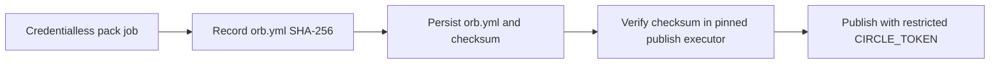

# Publish the orb

This guide is for Vexcalibur maintainers who can administer the CircleCI organization, its contexts, and GitHub release tags. The `vexcalibur-dev/vexcalibur` registry entry exists and development versions publish from `main` after the hosted checks pass.

The one-time CircleCI setup is complete.

A production orb version is immutable. Complete the development publication and verification before creating a release tag.

The `orb-publishing` context must remain restricted to this project. Before a
production release, check the live context restrictions and organization
membership in CircleCI. An `All members` restriction is acceptable only while
the organization has one trusted member. Add a dedicated release-maintainer
security group before adding another member, or the new member will gain access
to the publishing credential.

## Gather the required access

You need:

- Owner access to the Vexcalibur CircleCI organization
- Maintainer access to `vexcalibur-dev/vexcalibur-orb` on GitHub
- A CircleCI personal API token with the production publishing scope required by `circleci/orb-tools`
- Permission to create a restricted CircleCI context
- The [CircleCI CLI](https://circleci.com/docs/guides/toolkit/local-cli/) for local checks and registry verification

The token used by the publishing jobs grants broad organization access. Store it only in the CircleCI context described below. Don't reuse it for local CLI work or add it to another secret store for this workflow. Never export it in a shared shell or paste it into configuration.

Run `circleci setup` to authenticate the local CLI through its prompt with your maintainer credentials. Confirm the CircleCI host, then verify the organization UUID separately before creating registry resources.

## Create the registry resources once

Skip a step when the named resource already exists and is owned by the expected Vexcalibur organization. The namespace and public orb are global registry names; don't create substitutes from a personal organization.

1. Find the CircleCI organization UUID and assign it locally:

   ```bash
   CIRCLECI_ORG_ID=00000000-0000-0000-0000-000000000000
   ```

   Replace the reserved example UUID with the Vexcalibur CircleCI organization UUID.

2. Create the public namespace:

   ```bash
   circleci namespace create vexcalibur-dev --org-id "$CIRCLECI_ORG_ID" --no-prompt
   ```

3. Create the public orb:

   ```bash
   circleci orb create vexcalibur-dev/vexcalibur --no-prompt
   ```

   The command creates a world-readable registry entry. It doesn't publish a version.

4. Connect `vexcalibur-dev/vexcalibur-orb` as a CircleCI project. Use the GitHub OAuth integration if the release policy requires a security group to limit publishing to maintainers.

5. In **Project Settings** > **Advanced**, confirm **Enable dynamic config using setup workflows** is on. CircleCI enables it by default for newer projects, but the setting still needs verification. The checked-in `.circleci/config.yml` has `setup: true` and uses `orb-tools/continue` to load `.circleci/test-deploy.yml`. See CircleCI's [dynamic configuration setup](https://circleci.com/docs/guides/orchestrate/dynamic-config/#enable-dynamic-config).

6. Create an empty CircleCI context named `orb-publishing`. Don't add the
   production token yet.

   ```bash
   circleci context create --org-id "$CIRCLECI_ORG_ID" orb-publishing
   ```

   Skip this command when the context already exists.

7. Add a project restriction that limits `orb-publishing` to `vexcalibur-dev/vexcalibur-orb`. Don't leave a publishing context available to every project in the organization.

8. Add this expression restriction to `orb-publishing`:

   ```text
   (pipeline.git.branch == "main" or pipeline.git.tag matches /^v[0-9]+\.[0-9]+\.[0-9]+$/) and not job.ssh.enabled and not (pipeline.config_source starts-with "api")
   ```

   The expression permits the publishing context only on `main` or an exact
   production tag. It rejects SSH reruns and unversioned API configuration.
   CircleCI fails closed when a value is missing or the expression cannot be
   evaluated.

9. If the organization has a GitHub team for release maintainers, also restrict the context to that security group. CircleCI supports context security groups only with its GitHub OAuth integration.

   A project restriction is required. A security-group restriction is optional for an organization with a single trusted maintainer, but becomes useful when more maintainers have CircleCI access.

10. Verify the live context restrictions in CircleCI. The context must show the
    `vexcalibur-orb` project and the exact expression from step 8. If a
    release-maintainer group exists, verify that from an account outside the
    group.

    CircleCI documents [project, group, and expression restrictions](https://circleci.com/docs/guides/security/contexts/#restrict-a-context).
    Complete this verification before storing or using the production token.

11. Add GitHub tag rulesets for `v*`. Allow only the Vexcalibur automation App
    to create release tags, and don't allow any actor to update or delete them.
    Verify the live bypass actors and rules before continuing. The CircleCI
    release workflow narrows production tags further to
    `vMAJOR.MINOR.PATCH`.

12. Store the personal API token under the exact variable name `CIRCLE_TOKEN`:

    ```bash
    circleci context store-secret --org-id "$CIRCLECI_ORG_ID" orb-publishing CIRCLE_TOKEN
    ```

    `store-secret` prompts for the value so it doesn't become a command-line
    argument.

Rotate the token when a maintainer with access leaves the release group. Update the context after rotation and confirm the former token no longer works.

## Validate the source locally

Follow [the contributor setup](../../CONTRIBUTING.md#prepare-a-development-environment), activate `.venv`, and run these commands from the repository root:

```bash
python -m unittest discover -s tests
scripts/validate-circleci.sh
```

Both commands should exit with status `0`. The validation script packs the source, injects it into `.circleci/test-deploy.yml`, processes both CircleCI configurations, and checks the sensitive jobs' executor and step order. It validates every generated configuration. Generated files stay in a temporary directory.

The publication handoff separates artifact creation from credential use:



The pack job runs without the `orb-publishing` context. It stores the checksum as a CircleCI artifact and persists `orb.yml` with its one-entry checksum manifest. The publish job uses the same CircleCI CLI image pinned by tag and registry digest, attaches those two files, and verifies the digest before the orb-tools publication step. A checksum mismatch stops the job before publication. The workflow disables orb-tools' optional pull-request comment, so the publishing context does not need a GitHub token.

The checksum detects an artifact that changed between the two stages. Because
the orb and checksum travel through the same CircleCI workspace, it does not
independently authenticate CircleCI's storage. The project restriction,
current organization membership, expression restriction, immutable executor
image, and CircleCI workspace controls remain part of the release trust
boundary. A dedicated release-maintainer group becomes part of that boundary
only after the context is restricted to it.

## Publish and test a development version

Push the release candidate to `main`. CircleCI runs the setup workflow, then continues into `test-deploy` with the packed local orb inserted under the `vexcalibur` name.

`publish-dev` runs automatically after all four prerequisites succeed:

- `pack-dev`
- `command-help-test`
- `format-output-test`
- `job-help-test`

Open the `pack-dev` artifacts and confirm `packed-orb/orb.yml.sha256` contains one SHA-256 entry for `orb.yml`. The `publish-dev` job verifies that entry before it publishes.

The `publish-dev` job uses the restricted context to publish two development aliases: `dev:<commit-sha>` and `dev:alpha`. Development versions expire after 90 days, and both aliases are mutable. The commit-shaped name identifies the intended publication; it does not make that publication immutable.

From a checkout of the published commit, run:

```bash
DEV_VERSION="dev:$(git rev-parse HEAD)"
circleci orb info "vexcalibur-dev/vexcalibur@${DEV_VERSION}"

(
  set -euo pipefail
  PACKED_SOURCE="$(mktemp)"
  REGISTRY_SOURCE="$(mktemp)"
  trap 'rm "$PACKED_SOURCE" "$REGISTRY_SOURCE"' EXIT

  circleci orb pack --skip-update-check src >"$PACKED_SOURCE"
  circleci orb source --skip-update-check \
    "vexcalibur-dev/vexcalibur@${DEV_VERSION}" >"$REGISTRY_SOURCE"
  python - "$PACKED_SOURCE" "$REGISTRY_SOURCE" <<'PY'
from pathlib import Path
import sys

packed = Path(sys.argv[1]).read_bytes()
registry = Path(sys.argv[2]).read_bytes()
if registry not in (packed, packed + b"\n"):
    raise SystemExit("registry source differs from the locally packed orb")
PY
)
```

The metadata command should resolve the named development version. The source
comparison should produce no output and exit with status `0`; it ignores only
one trailing newline added by the registry. Confirm the production
`publish-release` job did not run on the branch pipeline.

The continuation tests exercise the packed command and job with `--help`. They also generate and validate CycloneDX, OpenVEX, and CSAF JSON from checked-in local fixtures. The format test uses `--offline` and never queries public OSV.

The CSAF check verifies:

- Publisher and tracking metadata
- The first document revision
- The Vexcalibur generator version
- A versioned product package URL
- The `under_investigation` mapping
- The absence of a root `$schema` property

These checks run only in hosted CircleCI. Local configuration validation proves that the workflow parses, not that its jobs have executed.

## Production release status

Production release creation is not available yet. [Issue #22](https://github.com/vexcalibur-dev/vexcalibur-orb/issues/22)
tracks the workflow that will calculate the next version and use the
Vexcalibur automation App to create a protected, create-only Git tag and a
GitHub Release protected by the organization's immutable-release policy.
Don't create a release-looking tag or GitHub release by hand.

The CircleCI side of the release path is already implemented. When the
automation App creates an exact `vMAJOR.MINOR.PATCH` tag, the tag pipeline runs
`pack-release`, `release-source-check`, the three acceptance jobs, and
`publish-release`. The source check rejects a tag whose commit is not reachable
from `origin/main`; the publish job verifies the packed source checksum before
it uses the restricted registry credential.

After issue #22 closes, this guide must include the tested dispatch, monitoring,
verification, and recovery commands before the first production release. The
first-release checklist must also replace the pending status in `README.md`,
`SECURITY.md`, and `docs/reference/orb.md` with the verified registry version
and its support status.

## Diagnose common failures

| Symptom | Check |
| --- | --- |
| Setup workflow doesn't continue | Confirm the project is connected and dynamic config is enabled. Then inspect `orb-tools/continue`. |
| `No Orb Publishing Token detected` | Confirm the `orb-publishing` context is attached, its variable is named `CIRCLE_TOKEN`, and the project can access the context. |
| Packed orb SHA-256 does not match | Do not retry publication unchanged. Inspect the `pack-dev` or `pack-release` checksum artifact and workspace-producing job, then rerun from a trusted commit after finding the cause. |
| Registry says the namespace or orb doesn't exist | Complete the one-time namespace and orb creation with the Vexcalibur CircleCI organization. |
| `release-source-check` fails | Confirm the tag commit is reachable from `origin/main`. Don't weaken or bypass the check. |
| Production publish says the version exists | Treat the registry version as immutable and publish a new patch version if a correction is needed. |
